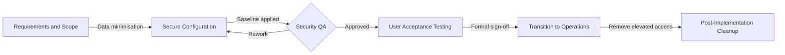

# Secure Service Delivery & Implementation Framework with ISO 27001 and ITIL 4
A structured implementation and transition framework that treats onboarding as control-bearing work, not operational overhead.
Designed for secure SaaS client onboarding, controlled service transition and audit-ready evidence.

**Context:** SaaS Client Onboarding & Change Transition  
**Alignment:** ISO/IEC 27001:2022 (A.5.10, A.5.12–A.5.18, A.8.9, A.8.10, A.8.15–A.8.16, A.8.32) and ITIL 4  

## 📖 Overview
Security weaknesses rarely originate in production. They are introduced earlier, during onboarding and transition, when delivery activities are rushed, configuration decisions go undocumented and access is provisioned without a clear baseline.
This project presents a security-first implementation framework that embeds governance requirements directly into delivery work. It positions the Implementation Analyst role as a point of control, responsible for secure data handling, access provisioning, configuration validation and clean handover into operations.
The framework aligns day-to-day implementation tasks with ISO/IEC 27001:2022 Annex A control themes and ITIL 4 service management practices, demonstrating how governance can be satisfied through disciplined process and evidence rather than parallel compliance exercises.

## 🔄 The Secure Transition Lifecycle
The following workflow ensures security controls are validated at every stage of the implementation.

The lifecycle models onboarding as a controlled transition. Each stage has defined checks and exit conditions before progression.

## ✅ Scope
1. Secure intake and handling of onboarding data
2. Access provisioning and role design (least privilege)
3. Configuration baselines and validation prior to go-live
4. Change traceability, approvals, and clean handover into operations
5. Post-implementation cleanup and removal of temporary access

## 🚫 Out of Scope
1. Secure software development lifecycle (SDLC) and code review
2. Vulnerability research or penetration testing
3. Continuous monitoring, alerting, and incident response operations
4. Infrastructure build pipelines outside the onboarding process

## 👥 Roles and Accountability
1. Implementation Analyst: applies the baseline, completes the checklist, captures evidence
2. Service/Client Owner: approves final configuration and go-live readiness
3. Operations/Support: receives the handover pack and owns the service post-transition

## 🧭 Control and Practice Alignment
The table below shows how common implementation tasks satisfy ISO 27001 control themes and ITIL 4 practices.

| Implementation activity         | ISO/IEC 27001:2022 Annex A theme        | ITIL 4 practice                  | Application                                                                                                                         |
| ------------------------------- | --------------------------------------- | -------------------------------- | ----------------------------------------------------------------------------------------------------------------------------------- |
| Client data intake              | Information protection and handling     | Information Security Management  | Sensitive onboarding data accepted only through approved secure channels. Email attachments containing sensitive data are rejected. |
| Data minimisation               | Information classification and handling | Knowledge Management             | Import files reviewed prior to processing. Non-essential fields removed and decisions documented.                                   |
| Admin account creation          | Access control                          | Service Configuration Management | Named administrative accounts created with MFA enforced. Shared or generic admin accounts are prohibited.                           |
| Authentication baseline         | Access control                          | Information Security Management  | Password policy, MFA enforcement, and session timeouts configured to a documented baseline.                                         |
| System configuration            | Configuration management                | Service Configuration Management | Tenant configuration validated against a defined baseline before UAT and again before go-live.                                      |
| Go-live approval                | Change control                          | Change Enablement                | Final configuration state recorded and formally approved prior to transition.                                                       |
| Audit logging validation        | Logging and monitoring                  | Information Security Management  | Authentication events and privilege changes verified as logged and retained.                                                        |
| Removal of temporary access     | Access control                          | Change Enablement                | Implementation-only elevated access removed immediately after handover.                                                             |
| Cleanup of onboarding artefacts | Information deletion                    | Information Security Management  | Temporary onboarding files removed from endpoints and sync locations according to policy.                                           |

## 📑 Artefacts Included
1. Secure onboarding checklist (secure_onboarding_checklist.md)
A repeatable SOP used during onboarding to apply controls consistently.
2. Implementation audit log (implementation_audit_log.csv)
A structured evidence trail capturing configuration actions, approvals, and compliance outcomes.
3. Framework and mapping (README.md)

The control intent and service management alignment for reviews, audits and handover.

## 🛠️ How to Use
1. Use the checklist during onboarding and configuration work.
2. Record changes and approvals in the audit log as you go.
3. Use this README to explain control intent during reviews and transition discussions.

## 📌 Evidence and Audit Intent
These artefacts are designed to support:
1. Audit and assurance reviews by showing what controls were applied at onboarding
2. Change traceability by linking configuration actions to approvals
3. Operational handover by providing a clear baseline and known risks at go-live

## 📈 How This Scales
The checklist and audit log are designed for reuse. As onboarding volume grows, they reduce reliance on personal memory, improve consistency across analysts, and preserve evidence quality. Over time, the baseline can evolve through controlled change rather than informal drift.