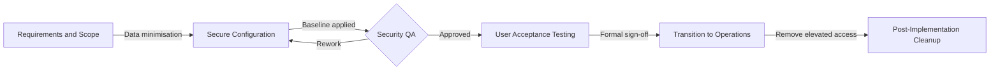

# Secure Service Delivery & Implementation Framework
A structured implementation and transition framework that treats onboarding as control-bearing work, not operational overhead.
Designed for secure SaaS client onboarding, controlled service transition, and audit-ready evidence.

**Context:** SaaS Client Onboarding & Change Transition  
**Alignment:** ISO/IEC 27001:2022 (A.5.10, A.5.15, A.8.9, A.8.32, A.8.10), ITIL v4  

## 📖 Overview
Security weaknesses rarely originate in production. They are introduced earlier, during onboarding and transition, when delivery activities are rushed, configuration decisions go undocumented, and access is provisioned without a clear baseline.
This project presents a security-first implementation framework that embeds governance requirements directly into delivery work. It positions the Implementation Analyst role as a point of control, responsible for secure data handling, access provisioning, configuration validation, and clean handover into operations.
The framework aligns day-to-day implementation tasks with ISO/IEC 27001:2022 Annex A control themes and ITIL 4 service management practices, demonstrating how governance can be satisfied through disciplined process and evidence rather than parallel compliance exercises.

## 🔄 The Secure Transition Lifecycle
The following workflow ensures security controls are validated at every stage of the implementation.

The lifecycle models onboarding as a controlled transition. Each stage has defined checks and exit conditions before progression.

## ✅ Scope
1. Secure intake and handling of onboarding data
2. Access provisioning and role design (least privilege)
3. Configuration baselines and validation prior to go-live
4. Change traceability, approvals, and clean handover into operations
5. Post-implementation cleanup and removal of temporary access