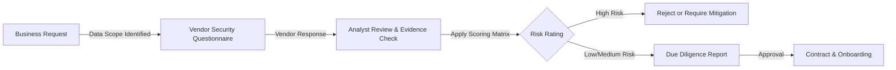

# Third-Party Risk Management (TPRM) Framework with ISO 27001 and ITIL 4

A practical, risk-based framework for assessing third-party vendors before onboarding.  
Designed to support secure SaaS ecosystems by ensuring suppliers meet baseline security expectations before they are introduced into production environments.

**Context:** Supply Chain Security and Vendor Onboarding  
**Alignment:** ISO/IEC 27001:2022 Annex A (A.5.19, A.5.20, A.5.21, A.5.22) and ITIL 4  

---

## 📖 Overview
Modern services rarely operate in isolation. Most platforms rely on external vendors for hosting, analytics, payments, support tooling or AI-driven functionality. Each integration introduces risk, often outside direct organisational control. This project presents a **risk-based Third-Party Risk Management (TPRM) framework** that focuses on the controls that matter most. Rather than relying on long, generic questionnaires, it prioritises evidence-backed security fundamentals such as encryption, access control, incident handling, and operational resilience. The framework is designed to support informed decision-making. It enables security and delivery teams to recommend approval, rejection, or conditional acceptance of vendors based on documented risk not assumptions.

---

## 🎯 Objectives
1. Standardise how new vendors are assessed before onboarding  
2. Focus assessment effort on critical security controls  
3. Translate vendor responses into a clear risk outcome (Low, Medium, High)  
4. Support contractual and onboarding decisions with documented evidence  
5. Enable periodic review and reassessment of supplier risk  

## 🔄 Assessment Workflow
The framework follows a simple, repeatable process that ensures no vendor is onboarded without a documented risk decision.

Each stage has a clear owner and output, creating traceability from request to decision.

## 🧭 Control Alignment
This framework aligns with the supplier relationship controls in ISO/IEC 27001:2022:
1. A.5.19 - Information security in supplier relationships
Overall governance of third-party security expectations.
2. A.5.20 - Addressing information security within supplier agreements
Contractual clauses, breach notification commitments and right-to-audit conditions.
3. A.5.21 - Managing information security in the ICT supply chain
Assessment of SaaS providers, sub-processors, hosting and integrations.
4. A.5.22 - Monitoring, review, and change management of supplier services
Periodic reassessment and conditional approvals based on risk.
5. From an ITIL 4 perspective, the framework supports Information Security Management, Supplier Management, Change Enablement and Knowledge Management.

## 📂 Artefacts Included
This project consists of three core operational artefacts:
1. Vendor Security Questionnaire (vendor_security_questionnaire.md)
A focused intake form used to gather information about a vendor’s security controls and practices.
2. Risk Scoring Matrix (risk_scoring_matrix.csv)
A structured scoring model that converts questionnaire responses into a risk rating.
3. Vendor Due Diligence Report (vendor_due_diligence_report.md)
A concise executive summary documenting findings, risk level, and a clear recommendation.

Together, these artefacts provide both operational guidance and audit-ready evidence.

## 📊 Risk Scoring Approach
Not all vendors carry the same level of risk. Scoring is based on a combination of:
1. Data criticality (for example PII, financial data, operational data)
2. Control maturity (policy, implementation, and independent assurance)
3. Certain controls are treated as non-negotiable. A vendor is automatically flagged as High Risk if any of the following are missing:
- Encryption of data at rest or in transit
- Multi-factor authentication for administrative access
- A defined breach notification commitment

This ensures that critical weaknesses are not diluted by averaging scores.
